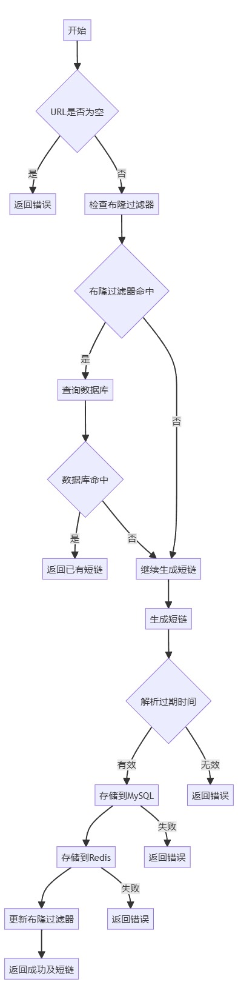
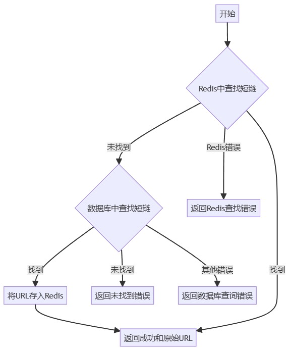

# 🚀 短链生成微服务项目（go-zero版）

本项目基于 go-zero 微服务框架，支持高性能短链生成、跳转、缓存与去重，适合分布式场景。

---

## 📦 项目结构
- `short-url/service`：gin 单体版
- `short-url/zero_remake`：go-zero 微服务版（推荐）

---

## ⚙️ 配置示例（YAML）
```yaml
Name: shorturl.rpc
ListenOn: 0.0.0.0:8888
Etcd:
  Hosts:
    - 127.0.0.1:2379
  Key: shorturl.rpc
Mysql:
  DbUser: root
  DbPort: "3306"
  DbPass: wwy040609
  DbName: shorturl
  DbHost: localhost
BizRedis:
  RedisHost: 127.0.0.1
  RedisPort: "6379"
  RedisPass: ""
  RedisDB: 0
```

---

## 🔗 核心接口
### 1. 生成短链（POST /generate）
请求参数：
```yaml
url: <原始长链>
expiration: <过期时间，如 1h>
```
返回：短链及状态码

### 2. 跳转短链（GET /{shortURL}）
请求参数：
- `shortURL` 路径参数
- 可选 `Authorization` 头
返回：自动重定向到原始长链

---

## 🧊 雪花算法（分布式唯一ID）
- 采用自定义雪花算法，支持时钟回拨容错，结构：
  - 41位时间戳 + 4位逻辑时钟 + 10位机器ID + 8位序列号
- 性能高，无需依赖数据库自增ID
- 详见：`zero_remake/shorturl_rpc/internal/logic/repository/mysnowflake.go`

---

## ⚡ Redis 缓存
- 热点数据优先存储于 Redis，极大提升查询速度，减少数据库压力
- 支持自定义过期时间，缓存失效后自动回源数据库并重设缓存
- 仅用字符串类型存储短链映射

---

## 🌸 布隆过滤器（去重&防穿透）
- 通过多哈希快速判断 URL 是否已生成短链，减少数据库查询
- 有极低误判率，极大节省内存
- 详见：`zero_remake/shorturl_rpc/internal/logic/repository/BoomFilter.go`

---

## 🛠️ 主要业务流程
### 1. GenerateShortURL
1. 校验 URL 是否为空
2. 布隆过滤器初筛，数据库精查
3. 雪花算法生成短链ID
4. 解析过期时间
5. 存储到 MySQL & Redis
6. 更新布隆过滤器



### 2. HandlerURL
1. 清理超期数据
2. Redis 查找原始 URL，未命中则查数据库
3. 返回原始 URL 并重定向



---

## 🧹 数据自动清理
- 超过一个月的短链数据自动从数据库删除
```go
func (l *HandleShortLogic) DeleteWithTime() error {
    return l.svcCtx.DB.Where("created_at < ?", time.Now().Add(-time.Hour*24*30)).Delete(&models.Shorturl{}).Error
}
```

---

## 💡 设计亮点
- 雪花算法彻底解决时钟回拨、机器ID唯一性、分布式高并发问题
- Redis 缓存+布隆过滤器，极大提升性能与可扩展性
- go-zero 微服务架构，易于横向扩展与维护

---

## 📚 参考
- [go-zero](https://github.com/zeromicro/go-zero)
- [redis/go-redis](https://github.com/redis/go-redis)
- [雪花算法原理](https://github.com/bwmarrin/snowflake)
- [布隆过滤器原理](https://blog.csdn.net/weixin_64366370/article/details/130693987)

---

> 如需更多示例或部署说明，请查阅源码或联系作者。

## IP限流器功能说明

### 功能简介
本项目后端集成了基于IP的限流器，防止恶意或高频请求导致数据库崩溃。

### 原理说明
- 每个请求会检测来源IP。
- 若某IP在短时间内请求次数超限，则拒绝服务，返回限流错误码（5001）。
- 前端收到限流响应后，会弹窗提示：
  > 为防止数据库崩溃，请半个小时后再生成

### 相关代码位置
- 后端限流逻辑：`zero_remake/shorturl_rpc/internal/logic/limit_processer/`
- 业务集成：`zero_remake/shorturl_rpc/internal/logic/generateshorturllogic.go`
- 错误码定义：`zero_remake/common/errmsg/errmag.go`
- 前端弹窗逻辑：`web/shorturl-frontend/src/App.vue`

### 效果演示
当用户请求过于频繁时，前端会弹出如下提示，用户需等待半小时后再尝试生成短链接。