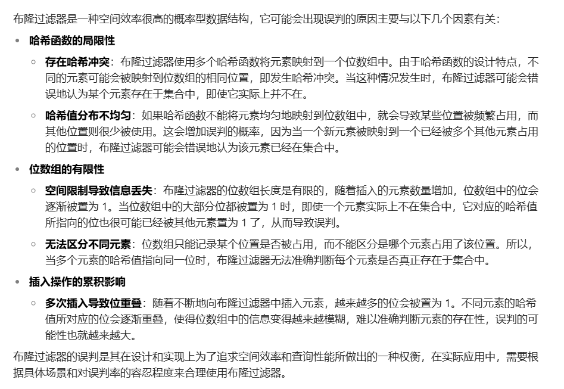
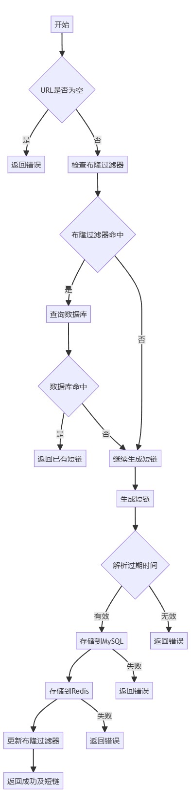
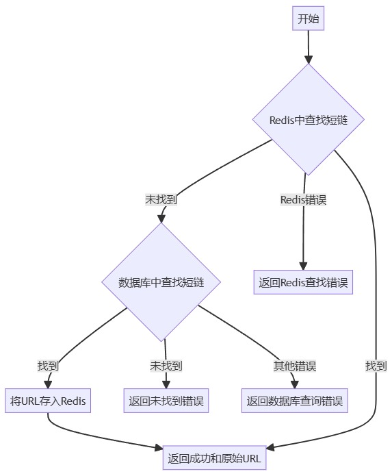

# 短链生成项目
## 1.配置文件选择***ini***
```
[server]
AppMode = debug
HttpPort = 8080

[database]
Db = mysql
DbHost = localhost
DbPort = 3306
DbUser = root
DbPass =wwy040609
DbName = shorturl

[redis]
RedisHost = 127.0.0.1
RedisPort = :6379
RedisPassword =
```

## 接口文档
### post 1.发送长链接
> Body 请求参数

```yaml
url: https://www.doubao.com/chat/?channel=bing_sem&source=dbweb_bing_sem_xhs_pc_01&keywordid=1&msclkid=dc6eb14c3f371e214a7ed6ca25f0b639
expiration: 1h

```

### 请求参数

|名称|位置|类型|必选| 说明   |
|---|---|---|---|------|
|Authorization|header|string| 否 | none |
|body|body|object| 否 | none |
|» url|body|string| 否 | 长链   |
|» expiration|body|string| 否 | 时间   |

### get 获取短链接
GET /localhost:8080/{shotURL}

### 请求参数

|名称|位置|类型|必选|说明|
|---|---|---|---|---|
|shotURL|path|string| 是 |none|
|Authorization|header|string| 否 |none|

## Redis
> 将数据存储在内存上，查询速度极快，可以存放热点数据，减少数据库查询次数<br>
> [redis的github地址](https://github.com/redis/redis)<br>
> [redis-go的github地址](https://github.com/redis/go-redis)

### Redis的几种数据结构
1. **字符串**：可以存储文本、序列化的对象等。例如，可以将用户的登录令牌存储为字符串，方便快速验证用户身份。
2. **哈希**：适合存储对象的多个属性。例如，可以存储用户信息，以用户 ID 为键，用户的各种属性（如姓名、年龄、地址等）作为哈希中的字段和值，方便快速查询和更新用户的单个属性。
3. **列表**：可用于实现消息队列、任务队列等应用场景。例如，将待处理的任务依次加入列表，多个消费者可以从列表中取出任务进行处理。
4. **集合**：存储不重复元素，可用于实现标签系统、好友列表、共同关注等功能。例如，将用户的关注用户列表存储为集合，方便进行集合运算，如求交集、并集等，以找出共同关注的用户。
5. **有序集合**：存储元素及其分数，可用于排行榜系统，根据分数对元素进行排序。例如，存储游戏玩家的分数，按分数对玩家进行排名。

### 本次项目中的Redis
1. 本次Redis中的键值对都是以**字符串**形式进行存储的
2. 本次Redis第一次可以自己设定时间，当Redis中的数据因为expiration设置到期而消失时，如果继续从数据库中可以获取时间，那么自动将其添加到缓存中从新设置为24h
```go
if err := model.Db.Where("shorturl =?", shortURL).First(&shortURLRecord).Error; err == nil {
			// 从数据库中找到了短链对应的原始 URL
			originalURL = shortURLRecord.Url
			// 将其重新添加到 Redis 中，假设设置过期时间为 24 小时，可根据需求修改
			err = model.Redis.Rdb.Set(model.Redis.Ctx, shortURL, originalURL, time.Hour*24).Err()
			if err != nil {
				// Redis 存储失败，返回错误
				return errmsg.ERROR_FAILED_SAVE_TO_REDIS, ""
			}
			return errmsg.SUCCESS, originalURL
		}
```
## 布隆过滤器
> Bloom Filter：short-url/server/BoomFilter.go

### 作用
1. 布隆过滤过滤器通过hash存储可以快速判断数据是否已经存在
2. 如果出现缓存和数据库中都没有的数据，那么可以通过布隆过滤器快速判断数据不存在，减少数据库查询次数（缓存穿透）
### hash 算法
[布隆过滤器的hash算法](https://blog.csdn.net/weixin_64366370/article/details/130693987)

### 布隆过滤器的优缺点

#### 优点
1. 时间复杂度低，增加和查询元素的时间复杂为O(N)，（N为哈希函数的个数，通常情况比较小）
2. 保密性强，布隆过滤器不存储元素本身
3. 存储空间小，如果允许存在一定的误判，布隆过滤器是非常节省空间的（相比其他数据结构如Set、Map集合）

#### 缺点
1. 有点一定的误判率，但是可以通过调整参数来降低
2. 无法获取元素本身
3. 很难删除元素

> #### 布隆过滤器出现误判的原因
> 

## short-url\server\server.go 服务层

### GenerateShortURL(发送长链接并生成短链接)

> #### 工作流程
> 1. 检查URL是否为空：如果URL为空，返回错误。
> 2. 检查布隆过滤器和数据库：先用布隆过滤器快速检查URL是否已存在，若可能存在则进一步查询数据库确认。
> 3. 生成短链：使用MD5哈希和Base64编码生成短链。
> 4. 解析过期时间：如果提供了过期时间，则解析并验证其格式。
> 5. 存储短链信息：将短链信息存储到MySQL，并将短链和原始URL存储到Redis中，同时设置过期时间。
> 6. 更新布隆过滤器：将原始URL添加到布隆过滤器。
     


### HandlerURL(获取短链接并跳转)
> #### 工作流程
> 1. 清除超时数据：调用 DeleteWithTime() 函数清除Redis中过期的数据。
> 2. 查找原始URL ：
       * 首先从Redis中查找短链接对应的原始URL。
       * 如果Redis中不存在，则去数据库中查找。
> 3. 处理结果：
        1. 如果在Redis或数据库中找到原始URL，返回成功并重定向到原始URL。
        2. 如果未找到或出现错误，返回相应的错误码。


## 特殊的

### 对于存在超过一个月的数据，会自动在数据库中删除
```go
func DeleteWithTime() {
	model.Db.Where("created_at < ?", time.Now().Add(-time.Hour*24*30)).Delete(&model.Shorturl{})
}
```

### server中的InDb函数
这个函数其实可以不用写的，因为每次重启程序布隆过滤器会重置，所以会重复查询添加，如果后端一直开着就不会出现这种问题
```go
func InDb(url string) bool {
	var shortURL model.Shorturl
	if err := model.Db.Where("url =?", url).First(&shortURL).Error; err == nil {
		// 已经生成过，直接返回短链
		return true
	}
	return false
}
```
```go
if Bloom.MightContain(url) {
		// 可能已经生成过，进行精确检查
		var shortURL model.Shorturl
		if err := model.Db.Where("url =?", url).First(&shortURL).Error; err == nil {
			// 已经生成过，直接返回短链
			log.Println("已经生成过，直接返回短链")
			return errmsg.SUCCESS, shortURL.Shorturl
		}
	}
```

你会发现布隆过滤器的判断和这个函数如出一辙
